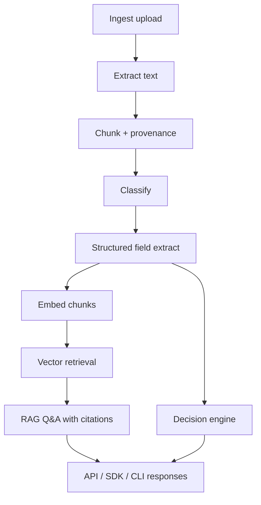

# DocMind Architecture

DocMind is a **local-first application/backend** monorepo for document intelligence and deterministic decisions.

## Pipeline



```text
Ingest → Extract → Chunk → Classify → Embed → Retrieve → RAG
                                      ↘ Decision Engine
```

## AI interpretation vs deterministic rules

| Layer                                                     | Responsibility                             |
| --------------------------------------------------------- | ------------------------------------------ |
| LLM / heuristics (`packages/ai`, `classification`, `rag`) | Interpret text, classify, answer questions |
| Decision engine (`packages/decision-engine`)              | Apply explicit rules to structured facts   |

The LLM does **not** decide ALLOW / REVIEW / REJECT. Rules do.

## Provider abstractions

- `LLMProvider` / `EmbeddingProvider` interfaces
- Default runtime/tests: **Mock** providers (deterministic, offline)
- Optional: Ollama HTTP providers for local models
- Vector store interface with:
  - in-memory implementation (default / CI)
  - PostgreSQL + pgvector implementation when `DATABASE_URL` is set

## Provenance / evidence

Chunks retain document id, offsets, and optional page numbers. RAG returns citations with source chunk text, scores, and grounding flags. Decision results reference which rules fired.

## Observability

- Structured Fastify/Pino JSON logs with `requestId`
- Metrics registry counters/latencies
- Error tracker with secret redaction and optional `ErrorSink` hooks for external systems
- Clients never receive stack traces

## Security boundaries

1. Uploaded files validated before storage
2. Blob keys cannot escape the storage root
3. Document text wrapped as untrusted data in prompts
4. Optional Bearer auth, Helmet headers, rate limits
5. Lexical answer grounding refuses unsupported RAG answers

## Quality gates

```bash
pnpm lint && pnpm format:check && pnpm typecheck && pnpm test:coverage && pnpm build && pnpm audit:prod
```
